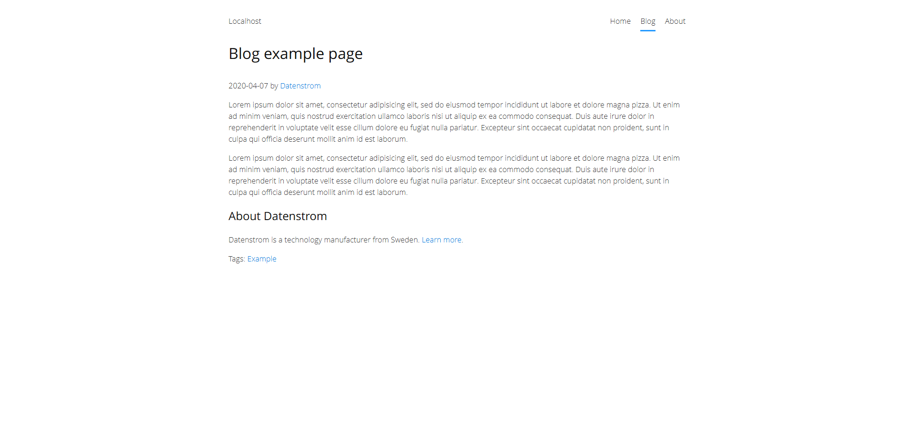

# Include 0.9.2

Include shared pages. Developed by Steffen Schultz.

<p align="center"></p>

## How to install an extension

[Download ZIP file](https://github.com/schulle4u/yellow-include/archive/refs/heads/main.zip) and copy it into your `system/extensions` folder. [Learn more about extensions](https://github.com/annaesvensson/yellow-update).

## How to include shared page content

Create a `[include]` shortcut. 

The following mandatory argument is available:

`Slug` = URL slug of shared page  

## Examples

Here is an example page `content/shared/profile-datenstrom.md`: 

```
---
Title: profile-datenstrom
---
## About Datenstrom

Datenstrom is a technology manufacturer from Sweden. [Learn more](https://datenstrom.se). 
```

Example blog page with included author profile:

```
---
Title: Blog example page
Published: 2020-04-07
Author: Datenstrom
Layout: blog
Tag: Example
---
Lorem ipsum dolor sit amet, consectetur adipisicing elit, sed do eiusmod tempor incididunt ut labore et dolore magna pizza. Ut enim ad minim veniam, quis nostrud exercitation ullamco laboris nisi ut aliquip ex ea commodo consequat. Duis aute irure dolor in reprehenderit in voluptate velit esse cillum dolore eu fugiat nulla pariatur. Excepteur sint occaecat cupidatat non proident, sunt in culpa qui officia deserunt mollit anim id est laborum. [--more--]

Lorem ipsum dolor sit amet, consectetur adipisicing elit, sed do eiusmod tempor incididunt ut labore et dolore magna pizza. Ut enim ad minim veniam, quis nostrud exercitation ullamco laboris nisi ut aliquip ex ea commodo consequat. Duis aute irure dolor in reprehenderit in voluptate velit esse cillum dolore eu fugiat nulla pariatur. Excepteur sint occaecat cupidatat non proident, sunt in culpa qui officia deserunt mollit anim id est laborum.

[include profile-datenstrom]
```

Do you have questions? [Get help](https://datenstrom.se/yellow/help/).
